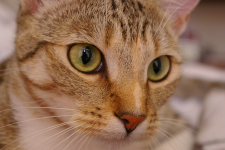

# Makine Algılaması ve Veri Temsili

Makine Öğrenmesi dersi kapsamında hazırladığım 1. ödev. Bir yapay zeka sisteminin bir fotoğrafı nasıl "gördüğünü", yani görüntünün bilgisayarda sayılarla nasıl temsil edildiğini inceliyorum.

## Neler yaptım?

1. Bir kedi fotoğrafını Python ile açtım.
2. Görüntünün genişlik, yükseklik ve kanal bilgisini çıkardım.
3. Kırmızı, yeşil ve mavi kanalları ayrı ayrı gösterdim.
4. Görüntüyü gri tona çevirdim.
5. Ortalama, minimum ve maksimum piksel değerlerini hesapladım.
6. Görüntüyü 0–1 aralığına normalize edip modele verilecek bir girdi vektörüne dönüştürdüm.
7. Bu verinin bir sınıflandırma modeli için ne anlama geldiğini yorumladım.

## Sonuçlar

| Bilgi | Değer |
|---|---|
| Boyut | 451 × 300 piksel |
| Kanal | 3 (RGB) |
| Toplam sayı (girdi) | 405.900 |
| Gri ton ortalama | 119,48 |
| Gri ton min / maks | 4 / 194 |

**Ana fikir:** Biz fotoğrafta bir kedi görürüz, bilgisayar ise 405.900 tane sayı görür. Model, bu sayılarla "kedi" etiketi arasındaki ilişkiyi öğrenmeye çalışır.

## Kullanılan araçlar

Python · Google Colab · NumPy · Pillow · Matplotlib · scikit-image

## Nasıl çalıştırılır?

`Odev1_Shohrat_Merdanov.ipynb` dosyasını [Google Colab](https://colab.research.google.com)'a yükleyip **Runtime → Run all** seçeneğini kullanın. Ek bir kurulum gerekmez.

## Kaynak

Görüntü: scikit-image örnek veri seti (`skimage.data.chelsea`).
